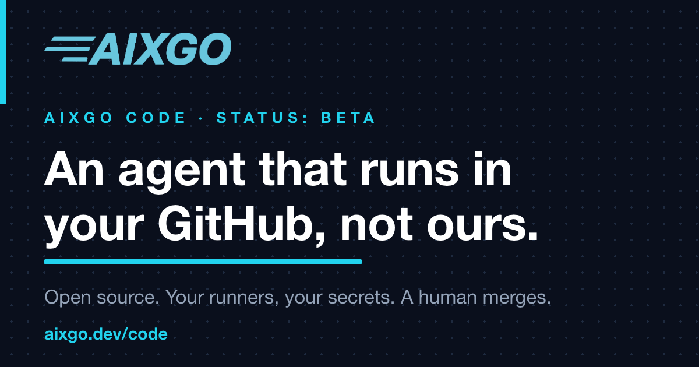
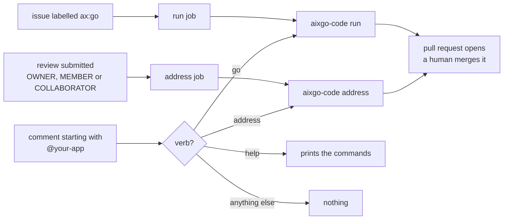

# Aixgo Code

[](https://aixgo.dev/code?utm_source=github&utm_medium=readme&utm_campaign=code)

Aixgo Code is an autonomous coding agent you install into your own GitHub. Your team files an issue, the agent prepares a pull request in your repository, and one of your reviewers decides whether it ships.

> Beta. Current release: `v0.6.0`. Product overview: [aixgo.dev/code](https://aixgo.dev/code?utm_source=github&utm_medium=readme&utm_campaign=code). See [Status](#status).


## Contents

- [Product overview](#product-overview)
- [Why teams use it](#why-teams-use-it)
- [Installation](#installation)
- [How it works](#how-it-works)
- [Configuration](#configuration) — `.github/aixgo.yml` options
- [Engines](#engines) — Codex (Azure), Claude, Gemini (Vertex): required env vars
- [Deployment model](#deployment-model)
- [Status](#status)
- [Security](#security)
- [Full setup walkthrough](docs/setup.md)

## Product overview

Aixgo Code turns a GitHub issue into a proposed code change inside your own environment. Your team keeps the repository, runners, secrets, and branch protection rules. The agent does the implementation work, but it never merges its own pull requests.

For a customer team, the model is simple:

- Your developers describe work in GitHub issues.
- Aixgo Code implements against the repository's existing quality gate, such as `make check`.
- The agent opens or updates a pull request for human review.
- Your team keeps final control over merge, release, and production access.

The product is designed for teams that want autonomous implementation without handing their source code or GitHub credentials to a hosted vendor runtime. Everything runs in your own GitHub Actions environment, on your runners, using your secrets.

## Why teams use it

- It runs inside your GitHub, not Aixgo's infrastructure.
- It uses your repository's existing quality gate instead of inventing its own definition of done.
- It is built for a human-review workflow, not auto-merge automation.
- It keeps permissions narrow: the agent can propose changes, but not deploy or merge them.

## Installation

Install the pinned release you want to run. Replace `<release-tag>` with the
version you want from [Releases](https://github.com/aixgo-dev/code/releases):

```sh
go install github.com/aixgo-dev/code/cmd/aixgo-code@<release-tag>
aixgo-code version
```

With `v0.6.0`, that prints `0.6.0`. Pre-1.0 releases follow semver with the
usual caveat: minor versions may still change behavior. Pin the tag you have
validated rather than floating on `@latest`.

### Install into your GitHub

To run the loop inside your own GitHub Actions:

1. Create and install **your own** GitHub App. App names are globally unique, so it cannot be named after ours, and its private key is what mints the tokens that act on your repository.
   Repository permissions: `Contents`, `Pull requests`, and `Issues` only.
   Do not grant `Workflows`, `Administration`, `Environments`, or `Secrets`.
   That means the App cannot push changes under `.github/workflows/`: if a run needs to edit a workflow file, make that commit as a human or run the CLI locally under your own `gh` auth instead of the App token.
   Disable the App webhook: the App is an identity that mints per-job tokens, and there is no Aixgo server to receive deliveries.
   Set install visibility to `Any account`.
   Install it on the repo.
2. In the adopter repo, run `aixgo-code init --workflow --app-name <your-app>`. Interactively (TTY), init asks which engine to use; pass `--engine codex|gemini|claude` to skip the menu. Non-interactive runs default to `codex` and print that default. That writes `.github/aixgo.yml` with `engine:`, writes a **conditional** `.github/workflows/aixgo.yml` that only wires credentials for the chosen engine (pinned to a released reusable-workflow tag), and creates the `ax:*` labels through your local `gh` auth. Existing starter files are left unchanged; pass `--force` to overwrite (for example to switch engines).
3. Fill in the real `gate:` in `.github/aixgo.yml`.
4. Add repository variable `AIXGO_GH_APP_CLIENT_ID` (the App Client ID, the `Iv23` string on the App settings page) and repository secret `AIXGO_GH_APP_PRIVATE_KEY`, plus the engine credentials init listed for your choice (Azure for Codex, Vertex for Gemini; Claude is local-CLI today — Actions wiring tracked in [#147](https://github.com/aixgo-dev/code/issues/147)).
   These are per-repository and are never inherited from Aixgo: a reusable workflow runs with the calling repository's own variables and secrets.
   The private key secret must be the full PEM contents, including the `-----BEGIN` and `-----END` lines.
5. Open a setup pull request in the adopter repo and merge it yourself. Setup files are written locally by `aixgo-code init` and merged by a human, because the runtime holds no `workflows` permission and cannot add its own workflow files.
6. File an issue and apply `ax:go`. Reviews submitted on the resulting pull request call back into the same reusable workflow for the fix-on-request loop.

Each reusable-workflow job mints its own installation token for the current
repository and asks only for `contents`, `pull requests`, and `issues`. The
workflow then probes an Actions-administration endpoint and expects a denial, so
the run log shows the token does not carry the workflow/admin scope the App was
deliberately denied.
If a change touches `.github/workflows/`, that token cannot deliver it; use a
human commit or a local CLI run under your own GitHub auth for those edits.

[docs/setup.md](docs/setup.md) walks the whole install in one place, from the CLI through the first issue-driven pull request, and is the reference if any step above is unclear.

## How it works

The customer workflow is issue to pull request, driven entirely through GitHub.

1. A human files an issue and applies the `ax:go` label. That label is the only thing a person applies to start the work.
2. The agent implements the change on a branch and runs the repo's own quality gate, using the gate's output to guide each retry until it passes or it stops and asks for a human.
3. Once the gate passes, the agent opens a pull request and hands it back to a human.
4. A human reviews. If they request changes, a fixer role reads the feedback, makes the changes, re-runs the gate, and pushes back to the same pull request for another look. Only feedback left against the current head is addressed, so the loop never re-litigates a comment it already handled.
5. A human merges. The agent does not.

An automated reviewer can also run before human review if you turn on `review: true`. It comments on the change; it does not approve and it does not merge.

### Label lifecycle

You drive the agent by applying one label and reading the pull request. The bot manages the rest of the state. Labels use a configurable prefix (`labelPrefix`, default `ax`). An issue sits in one state at a time.

| Label | Applied by | Meaning |
| --- | --- | --- |
| `ax:go` | human | Start work on this issue. The only trigger a person sets. |
| `ax:queued` | bot | Accepted, waiting to start. |
| `ax:working` | bot | Implementing the change. |
| `ax:review` | bot | Review and fix pass in progress. |
| `ax:blocked` | bot | Needs a human. The agent stopped and left a note. |
| `ax:done` | bot | The bot is finished. A human merged the pull request; the bot closes out the issue. |

You can also drive it by comment, addressed to the bot at the start of a line:

Commands address **your own App**, not ours. If you installed an App called
`acme-code`, your team types:

- `@acme-code go` on an issue starts work on it, the same as applying `ax:go`.
- `@acme-code address` on a pull request addresses the current review feedback.
- `@acme-code help` lists what it understands.

The handle is per-repository because App names are globally unique, so every
installation has its own. It is also why GitHub offers the bot in the
autocomplete after someone types `@`: it suggests accounts with access to the
repository, which a fixed prefix could never be. You set it once with
`aixgo-code init --app-name`, and it is stored as `appName:` in
`.github/aixgo.yml`.

Only comments from people with write access are acted on, and only a comment that begins with the mention counts, so quoting an earlier comment never re-triggers a run. Note that a plain pull-request comment is not a review: to run the fixer from a review, submit it through **Files changed → Review changes**.

### What triggers a run



A plain comment in the conversation box is not a review. To run the fixer from a review, submit it through **Files changed → Review changes**. Every path checks that the person has write access before anything else happens.

## Trying it without letting it write anything

```sh
aixgo-code run owner/repo#12 --dry-run
```

That runs the whole loop, including the model and your own gate. It makes no GitHub writes and never pushes; it prints what it would have done instead.

`aixgo-code init --workflow` also writes a self-test into your repository. Dispatch it once and it checks, in your own runner, that the App token resolves to a bot, that it can read what it needs, and that it is denied Actions administration. The install fails if that denial does not hold. Delete the workflow once it passes.

## Configuration

Configuration lives in `.github/aixgo.yml`. Engine credentials are **environment variables or Actions secrets**, never committed — see [Engines](#engines) for the table, and [docs/setup.md](docs/setup.md) for the full walkthrough.

A minimal file looks like this:

```yaml
labelPrefix: ax

gate: make check
```

The `gate` command is required. It is whatever your repo already runs to know a change is good, typically a typecheck, your tests, and a build, the same thing your CI runs. The agent cannot declare a change done until the gate passes.

By default the commits and pull requests the agent generates carry a "Aixgo Code" marker: a `Co-Authored-By` trailer on the commit and a footer line on the pull-request body, the same convention Claude Code uses for its own commits. To turn it off, set `attribution: false`:

```yaml
gate: make check

attribution: false
```

Generated pull requests carry a one-line body by default. Set `prDescription: rich` to have the agent add a generated walkthrough, a changes table, and a mermaid sequence diagram to the body of each pull request it opens. The sections are marked as generated and are additive to your own review, never a substitute for it; if the generation fails or produces nothing valid, the pull request opens with the plain body.

```yaml
gate: make check

prDescription: rich
```

Set `review: true` to turn on the automated reviewer. After the gate passes, a read-only reviewer role judges the change and writes a structured verdict; its findings go to the fixer before a human ever sees the pull request, and the verdict summary appears in the pull-request body. It never approves and never merges: a verdict is advice to the loop, and the human review is unchanged.

```yaml
gate: make check

review: true
```

A repo with no gate is refused, on purpose. An agent loop with nothing to stop it will wander, break things, and still report success. The gate is the safety mechanism, so the tool treats its absence as a configuration error rather than a default to paper over. The engineering that matters here is the gate, not the loop.

Getting the gate right is where first runs stall: it has to be green on your own `main`, it should mirror what your CI actually enforces, and the genuinely environmental checks (a version matrix, Docker, tests that need a running service) stay in CI. The [FAQ](docs/faq.md) walks through each of these with real onboarding examples.

## Engines

The model that writes the code sits behind a pluggable `Runner` interface, so you bring your own provider. `aixgo-code init` chooses the engine (`--engine` or an interactive menu) and writes `engine:` into [`.github/aixgo.yml`](#configuration) plus a caller workflow that only passes that provider's inputs/secrets. You can also set `engine:` by hand. The loop, roles, and gate are identical for every engine.

| Engine | Config | Local CLI | GitHub Actions | Credentials |
| --- | --- | --- | --- | --- |
| **codex** (default) | omit `engine:` or `engine: codex` | yes | yes | `AIXGO_AZURE_OPENAI_ENDPOINT`, `AIXGO_AZURE_OPENAI_API_KEY` |
| **claude** | `engine: claude` | yes | not yet (workflow does not install Claude CLI) | your existing `claude` CLI auth |
| **gemini** | `engine: gemini` | yes | yes | `AIXGO_VERTEX_PROJECT`, `AIXGO_VERTEX_API_KEY`, optional `AIXGO_VERTEX_LOCATION` (default `us-central1`) |

Full install steps and Actions wiring: [docs/setup.md](docs/setup.md) (see *Local CLI* / *GitHub Actions* under engine choice).

### Codex on Azure (default)

```yaml
gate: make check
# engine: codex
```

```sh
export AIXGO_AZURE_OPENAI_ENDPOINT="https://<resource>.openai.azure.com"
export AIXGO_AZURE_OPENAI_API_KEY="<key>"
```

Optional model override defaults to `gpt-5.4` if unset.

### Claude (local CLI)

```yaml
gate: make check
engine: claude
```

Uses headless `claude -p` with whatever credentials that CLI already has. No Azure variables.

### Gemini on Vertex AI

```yaml
gate: make check
engine: gemini
```

```sh
export AIXGO_VERTEX_PROJECT="<gcp-project>"
export AIXGO_VERTEX_LOCATION="us-central1"   # optional
# Plain Vertex API key, OR the full contents of a service-account JSON key
# (JSON with "type":"service_account" is written to a temp file as ADC).
export AIXGO_VERTEX_API_KEY="<key-or-sa-json>"
```

In GitHub Actions, pass reusable-workflow inputs `vertex-project`, `vertex-location`, and secret `vertex-api-key` instead of Azure. The workflow installs `@google/gemini-cli` when `vertex-project` is set. Default model is `gemini-3.5-flash` (override with `--model` / workflow `model:`).

## Deployment model

Aixgo Code is deployed into your GitHub organization. There is no Aixgo-hosted control plane managing your repositories for you. When your team installs the GitHub App and adds the workflow, the work runs on your runners inside your account.

### What it can do, and what stops it

It can open a pull request against a branch. That is the strongest action available to it.

What stops it, roughly in order of how much you should trust each one:

1. **It cannot merge, by construction.** The GitHub interface it is built against has no merge method: see [`internal/forge/forge.go`](internal/forge/forge.go). The model is not being asked to follow a rule here. The capability is absent from the code.
2. The App holds three permissions: contents, pull requests, issues. Not workflows, administration, environments, or secrets. Each job mints its own token, scoped to one repository.
3. That scope is proved on every run rather than claimed. The workflow calls an Actions-administration endpoint and expects the denial, so your run log carries the evidence.
4. **The model's shell never holds a GitHub token.** `GH_TOKEN` and `GITHUB_TOKEN` are stripped from the engine's environment before it starts.
5. Neither engine's "dangerous" bypass flag is set. When a change cannot be made under those constraints, the run stops and a human finishes it. [Why](docs/faq.md).
6. No deploy credentials, and no path to production. Your branch protection rules decide what happens once the pull request exists.

What that means for customers:

- Your code stays in your repos. Aixgo never receives it.
- Your model provider keys, the GitHub App's private key, and any other secrets stay in your GitHub secret store. They are read by your own Actions runs and never transit our infrastructure.
- It does not use the engines' "dangerous" bypass flags, and does not receive a GitHub token in the model's shell. When a change cannot be made under those constraints, the run stops and a human finishes it. See the [FAQ](docs/faq.md).
- The agent holds no deploy credentials and has no path to production. The most it can do is open a pull request against a branch. A human and your branch protection rules decide what happens next.

Setup files are generated locally by `aixgo-code init` and then merged by a human, because the runtime holds no `workflows` permission and cannot add or update workflow files on its own.

The GitHub App identity is your own App's `[bot]` account. That bot is the single audit signal for everything the agent does.

## Status

Beta, and honest about it. Two loops run end to end via the CLI on the Codex-on-Azure engine: issue to pull request, and fix-on-request (a human requests changes, the fixer addresses them and pushes back). `v0.6.0` is the latest release and you should still expect rough edges.

Roadmap, roughly in order:

- The issue-to-pull-request loop. **Done.**
- The fix-on-request loop: a human requests changes, a fixer role addresses them. **Done.**
- Wiring the read-only reviewer role into the loop so a diff is reviewed before it reaches a human.
- The self-onboarding flow via `init` and `init --workflow`. **Done.**
- The Codex on Azure OpenAI engine adapter. **Done.**
- Gemini on Vertex AI (`engine: gemini`). **Done** on this branch / upcoming release.
- Self-hosted models on Hugging Face.

If you are evaluating it now, read that as beta software rather than a polished product. The core loops work; reviewer wiring is still in progress, and self-onboarding shipped as `init` and `init --workflow`.

## Contributing

The source is open under Apache-2.0, so you are free to read, audit, use, and fork it. Aixgo Code is developed by Aixgo and is not currently accepting external code contributions or pull requests. Bug reports and security reports are welcome through [issues](https://github.com/aixgo-dev/code/issues) and the process in [SECURITY.md](SECURITY.md). See [CONTRIBUTING.md](CONTRIBUTING.md) for details.

## Inspiration and lineage

Aixgo Code is a clean rebuild inspired by the open-source project [nexu-io/looper](https://github.com/nexu-io/looper). No code was copied.

Aixgo Code was formerly published as SimplyCubed Code at `simplycubed/code`; releases before `v0.4.0` carry that name and module path.

## Security

The agent proposes changes and never merges them, and it holds no deploy or production credentials. The strongest action available to it is opening a pull request against a branch, which a human then reviews.

To report a vulnerability, see [SECURITY.md](SECURITY.md).

## About Aixgo

Aixgo builds AI tooling for Go developers, including a production-ready AI agent framework: [aixgo.dev](https://aixgo.dev).

## License

Licensed under the Apache License, Version 2.0. See [LICENSE](LICENSE).

"Aixgo" and "Aixgo Code" are trademarks of Aixgo. The license does not grant any right to use these names. See [TRADEMARK.md](TRADEMARK.md).
