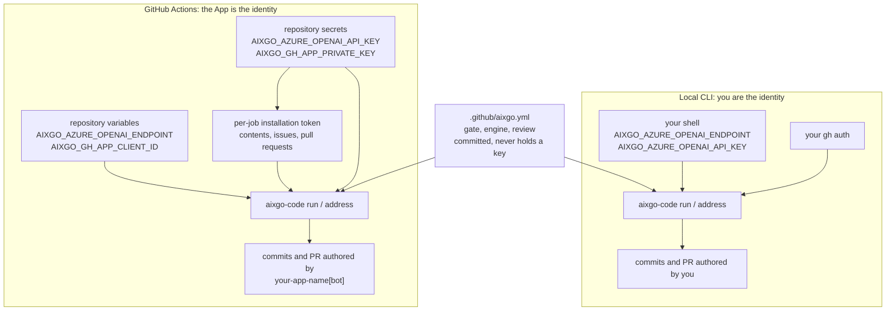

# Setup

This guide shows how to install Aixgo Code in a repository you control so
it can turn issues into pull requests inside your own GitHub environment.

You will:

- install the `aixgo-code` CLI
- generate the repository config and GitHub workflow files
- connect your GitHub App and model credentials
- run a one-time self-test
- hand the first issue to the agent

## Before you begin

You need:

- Go installed locally so you can run `go install`
- `gh` authenticated against the repository you want to onboard
- write access on that repository
- model credentials: an Azure OpenAI endpoint and API key (Codex, the default),
  or a Vertex AI project and API key (`engine: gemini`)

## Install and configure

1. Install the CLI. Replace `<release-tag>` with the version you want from
   [Releases](https://github.com/aixgo-dev/code/releases):

```sh
go install github.com/aixgo-dev/code/cmd/aixgo-code@<release-tag>
aixgo-code version
```

With `v0.5.0`, `aixgo-code version` prints `0.5.0`.

2. In the target repository, generate the setup files and labels:

```sh
aixgo-code init --workflow --app-name <your-app>
```

`--app-name` is the GitHub App you created in step 4, without the `[bot]`
suffix. **It is required, and it is yours, not ours.** App names are globally
unique, so every installation has a different one, and it is what your team
types to talk to the agent: `@<your-app> go` on an issue starts work.

Addressing your real App is also what makes GitHub help: it offers accounts with
access to the repository in the autocomplete, so someone types `@a` and is
offered your bot without having to know its name. A fixed prefix could never do
that, which is why the handle is per-repository rather than a constant.

That creates the `ax:*` labels through your local `gh` session and writes three
files into your repository:

- `.github/aixgo.yml`, the repository config
- `.github/workflows/aixgo.yml`, the workflow that runs Aixgo Code
- `.github/workflows/aixgo-selftest.yml`, a one-time installation check

These are local file changes in your repository. Nothing is merged or installed
remotely for you.

### The handle lives in two files, and they must agree

`init` writes your App name into both:

- **`.github/aixgo.yml`** as `appName:`. This is the source of truth. The
  agent reads it to decide what a command looks like, and it is a file the App
  can push, so the agent can maintain it.
- **`.github/workflows/aixgo.yml`** as the comment trigger. It has to be a
  literal there, because a workflow decides whether to start *before* any code
  runs. Matching loosely instead would spin up a runner every time someone
  mentions a colleague.

The App deliberately holds no `workflows` permission, so it cannot change the
second one. **If you rename your App, change `appName:` and re-run
`aixgo-code init --workflow` to rewrite the trigger.** `aixgo-code preflight`
fails when the two disagree, because the alternative is silent: comments would
simply stop working, with no error anywhere.

3. Edit `.github/aixgo.yml` and set a real gate that is already green on
your default branch. A minimal customer setup looks like this:

```yaml
labelPrefix: ax
appName: <your-app>
gate: make check
```

### Optional: prove it locally first

Before wiring GitHub Actions, you can prove the loop works from your terminal
with the same config file:

```sh
export AIXGO_AZURE_OPENAI_ENDPOINT="https://<resource>.openai.azure.com"
export AIXGO_AZURE_OPENAI_API_KEY="<key>"
aixgo-code run owner/repo#N --repo-dir .
```

4. Create and install the GitHub App identity, then add the required repository
settings.

**The App has to be your own.** Its private key is what mints the tokens that act
on your repository, so a shared key would let whoever holds it act on every other
installation of that App. That is why there is no App to install *from us*, and
it is what makes "runs in your GitHub, not ours" true rather than a slogan.

Create it at [github.com/settings/apps/new](https://github.com/settings/apps/new),
or at `https://github.com/organizations/<org>/settings/apps/new` if the repository
belongs to an organisation. GitHub's own reference is
[Creating GitHub Apps](https://docs.github.com/apps/creating-github-apps).

- **Name:** anything you like. App names are globally unique, so you cannot reuse
  ours, and your bot will be `<your-app-name>[bot]`.
- **Permissions**, and nothing else: `Contents: Read and write`,
  `Issues: Read and write`, `Pull requests: Read and write`.
- **Webhook:** uncheck `Active`. Actions triggers this runtime, so an enabled
  webhook with nothing listening only generates failures.
- **Where can this GitHub App be installed:** `Any account`, if the App belongs to
  your personal account and the repository belongs to an organisation. An App
  restricted to its owner cannot be installed anywhere else. This is the step most
  often missed.

Generate a private key on the App settings page and keep the download; GitHub
shows it once. Note the Client ID there too, the `Iv23` string. Then install the
App on the repository from `Install App`.

Then add these repository settings. **Variables and Secrets are different tabs**
under Settings > Secrets and variables > Actions, and a value filed under the
wrong one reads back as empty rather than failing:

- Variable: `AIXGO_GH_APP_CLIENT_ID`, the App Client ID, the `Iv23` string on the App settings page
- Secret: `AIXGO_GH_APP_PRIVATE_KEY`
- Variable: `AIXGO_AZURE_OPENAI_ENDPOINT`
- Secret: `AIXGO_AZURE_OPENAI_API_KEY`

The Actions runtime authenticates as your App, so the Client ID and private key
are both required. Store the private key as the full PEM contents, including the
`-----BEGIN` and `-----END` lines.

Each job mints its own installation token for that repository, so the agent
authors commits, pull requests, and comments as `<your-app-name>[bot]`, and its
pull requests receive their own CI runs. A personal access token is not an
alternative: the reusable workflow accepts App credentials only.

5. Commit the generated config and workflow files in the target repository, open
a setup pull request, and merge it yourself. Setup files are written locally by
`aixgo-code init` and merged by a human, because the runtime holds no
`workflows` permission and cannot add its own workflow files.

6. Run the installation self-test before you rely on the workflow:

```sh
gh workflow run aixgo-selftest
```

That runs in your own environment and reports whether the App token resolves to
a bot, whether it is correctly denied Actions administration, whether a commit
is possible, and whether the engine can start there. Delete the self-test
workflow once it passes; normal operation goes through the App and the `ax:go`
label.

7. File an issue that describes a small change and apply the `ax:go` label.

8. Wait for the workflow to open a pull request. Review it like any other PR:

- merge it yourself if it is good
- or request changes; the fixer loop will address feedback on the current head
  and push back to the same branch

That is the first end-to-end customer path: issue -> PR -> human merge.

## Day-to-day use

Once setup is complete, your team uses Aixgo Code through normal GitHub
workflows:

- apply `ax:go` to an issue to start implementation
- review the pull request the agent opens
- request changes if needed; the fixer loop pushes updates back to the same PR
- merge it yourself when it meets your standards

## Where each value goes

The same two Azure values are needed in both places, and setting one does not
set the other. A repository secret is not visible to your local shell, and a
reusable workflow inherits nothing from Aixgo.



## Azure values

The shipped Codex-on-Azure setup needs these values:

| Name | Where it is used | Secret? |
| --- | --- | --- |
| `AIXGO_AZURE_OPENAI_ENDPOINT` | Base Azure OpenAI endpoint, for example `https://<resource>.openai.azure.com` | No |
| `AIXGO_AZURE_OPENAI_API_KEY` | Azure OpenAI API key | Yes |
| model or deployment name | Optional override passed as `--model` locally or `model:` in the caller workflow | No |

If you do not set a model override, the CLI and reusable workflow default to
`gpt-5.4`.

## Where the key lives

The API key lives in different places depending on where `aixgo-code` runs.

- Local CLI run: export `AIXGO_AZURE_OPENAI_API_KEY` in the shell that runs
  `aixgo-code`. Do not commit it, and do not expect a GitHub repository secret
  to appear in your local terminal.
- GitHub Actions run: store `AIXGO_AZURE_OPENAI_API_KEY` as a repository secret. The
  caller workflow passes it into the reusable workflow job as an environment
  variable.

In both cases the config references the key by environment variable name. The
key value does not belong in `.github/aixgo.yml` or any committed file.

## Local CLI vs GitHub Actions

Use the same endpoint and key in both places, but wire them differently.

### Local CLI

For local runs such as `aixgo-code run owner/repo#123`, the CLI reads:

- `AIXGO_AZURE_OPENAI_ENDPOINT` from your shell environment
- `AIXGO_AZURE_OPENAI_API_KEY` from your shell environment
- the repo gate and label prefix from `.github/aixgo.yml`

Example:

```sh
export AIXGO_AZURE_OPENAI_ENDPOINT="https://<resource>.openai.azure.com"
export AIXGO_AZURE_OPENAI_API_KEY="<key>"
aixgo-code run owner/repo#123 --repo-dir .
```

To use Claude Code locally instead, set `engine: claude` in
`.github/aixgo.yml`. That local path uses your existing `claude` CLI
authentication and does not need Azure variables:

```yaml
gate: make check
engine: claude
```

```sh
aixgo-code run owner/repo#123 --repo-dir .
```

To use Gemini on Vertex AI instead, set `engine: gemini` and the Vertex
variables. The reusable workflow installs the Gemini CLI when
`vertex-project` is passed, and does not need Azure:

```yaml
gate: make check
engine: gemini
```

```sh
export AIXGO_VERTEX_PROJECT="<project>"
export AIXGO_VERTEX_LOCATION="us-central1"   # optional, this is the default
# Either a Vertex API key, or the contents of a service-account JSON key
# (a value starting with {"type":"service_account"...} is used as ADC).
export AIXGO_VERTEX_API_KEY="<key-or-sa.json-contents>"
aixgo-code run owner/repo#123 --repo-dir .
```

### GitHub Actions

For the hosted-in-your-GitHub path, the caller workflow in your repository
passes:

- `vars.AIXGO_AZURE_OPENAI_ENDPOINT` to the reusable workflow input
  `azure-openai-endpoint`
- `secrets.AIXGO_AZURE_OPENAI_API_KEY` to the reusable workflow secret
  `azure-openai-api-key`
- `vars.AIXGO_GH_APP_CLIENT_ID` to the reusable workflow input
  `github-app-client-id`
- `secrets.AIXGO_GH_APP_PRIVATE_KEY` to the reusable workflow secret
  `github-app-private-key`

The reusable workflow installs the CLI, exports the endpoint and key for the
job, and runs `aixgo-code run` or `aixgo-code address`.

The hosted path follows `.github/aixgo.yml` `engine:`. Codex (the default)
still needs the Azure endpoint and key, and the workflow installs the Codex
CLI. `engine: gemini` needs `vertex-project`, `vertex-location`, and
`vertex-api-key` instead, and the workflow installs the Gemini CLI. Claude
is still a local-CLI path; the reusable workflow does not install the Claude
CLI.

## Watching it run before it writes

Two commands answer "is this configured correctly" without changing anything:

```sh
aixgo-code preflight
```

That validates the repository config and the engine settings and exits. It is
what the workflow runs before installing the rest of the toolchain, so a
misconfigured repository finds out in seconds.

It names the section a missing value belongs in, because Variables and Secrets
are different tabs and a value filed under the wrong one reads back as empty
rather than failing:

```text
error: configuration missing: AIXGO_AZURE_OPENAI_ENDPOINT is not set. It is a
repository variable on your own repository, under Settings > Secrets and variables >
Actions; a reusable workflow never inherits variables from Aixgo
```

A missing value exits **3**, so a caller can tell "go and set this" apart from a
bug without matching on message text. In Actions the workflow passes `--actions`,
which also checks the App credentials; a local run authenticates as you and never
uses them.

```sh
aixgo-code run owner/repo#N --dry-run
```

That runs the whole loop, including the engine and your real gate, and skips
the push and every GitHub write. It prints what it would have done instead, and
in Actions writes that to the run summary.

If something goes wrong, [troubleshooting.md](troubleshooting.md) starts from
the symptom.

## Optional model override

If your Azure deployment name is not `gpt-5.4`, set it explicitly.

- Local CLI:

  ```sh
  aixgo-code run owner/repo#N --repo-dir . --model <deployment-name>
  ```
- GitHub Actions: uncomment and set `model:` in
  `.github/workflows/aixgo.yml`.

The current shipped workflow uses one model value per run. Per-role model
tiering is not wired yet.
